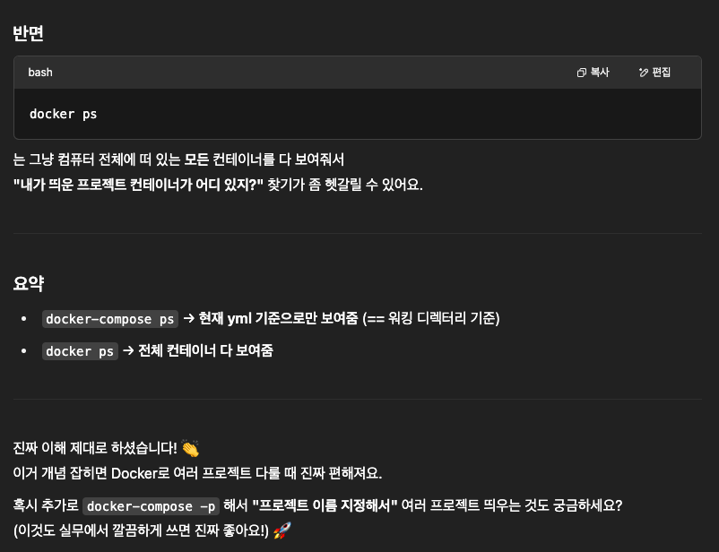

DBMS 설치는 로컬에 Docker 컨테이너를 통해 설치하고 추후 컨테이너 채로 삭제할 예정

아래는 이를 위한 간단한 `docker-compose` 설정 정보

```yml
version: '3.8'

services:
    postgres:
        image: postgres:15
        container_name: cqrs_postgres
        environment:
            POSTGRES_USER: cqrs_dev
            # 특수문자는
            POSTGRES_PASSWORD: '!q2w3e4r'
            POSTGRES_DB: cqrs_study
        ports:
            - "5432:5432"
        volumes:
            # ~ 상대경로 사용시 에러 발생
            - /Users/chinhyungrae/Documents/dev-study/wanted-cqrs/volumes/postgre/data
```

실행은 `-d` 옵션을 통해 백그라운드 실행을

컨테이너 상태는 `docker-compose ps`로 확인. `docker ps`와의 차이는 다음과 같이
현재 워킹 디렉터리의 docker-compose로 구동되는 컨테이너만 확인한다는 점이다.



```commandline
docker-compose up -d

docker-compose ps
```

실행 후 쿼리 실행 등은 DBeaver Client Tool를 사용할 예정
